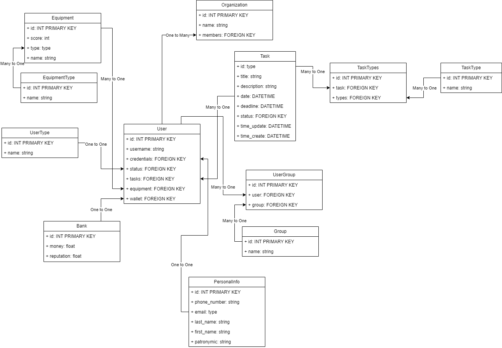

# Independent entepreneur simulator
Рогачёв Артём Андреевич 153504.

## 1. Минимальные функциональные требования
 * **Авторизация пользователя**:
   * Авторизованный пользователь способен:
     *  Брать задания и выполнять их.
     *  Получать деньги и репутацию за выполнение заданий.
     *  Покупать снаряжение.
     *  Вступать в одну и более группп.
     *  Присоединяться к организации.
   * Администратор способен:
     *  Создавать новые задания и снаряжение.
     *  Отслеживать прогресс других пользователей.
 * **Роли пользователей**:
   * администратор, авторизованный и неавторизованный пользователи.

## 2. Описание сущностей
1. **User**
- Основная сущность, хранящая информацию об авторизованных пользователях.
2. **UserType**
- Сущность, определяющая роль User - администратор или простой пользователь
3. **Equipment**
- Сущность хранящая информацию об снаряжении.
4. **EquipmentType**
- Определяет тип снаряжения.
5. **Bank**
- Определяет "кошелёк" пользователя, хранит его деньги и репутацию.
6. **PersonalInfo**
- Хранит личные данные пользователя (не данные для авторизации)
7. **Group**
- Определяет группу в которую может вступить пользователь. Пользователь может иметь несколько групп.
8. **UserGroup**
- Связывающая сущность для User и Group
9. **Organization**
- Определяет организацию к которой может примкнуть пользователь.
10. **Task**
- Определяет задание которое может выполнить пользователь.
11. **TaskType**
- Определяет тип задания.
12. **TaskTypes**
- Связывающая сущность для Task и TaskType

## 3. Описание таблицы
1. **User**
- Поля
  - Идентификатор (ID): integer, primary key, auto-increment.
  - Username: string, unique, not null.
  - Password: string, hashed password, not null.
- Связь
  - У пользователя может быть одна роль (One-to-One).
  - У пользователя может быть один набор личных данных (One-to-One).
  - У пользователя может быть один кошелёк (One-to-One).
  - Пользователь может взять несколько заданий (One-to-Many).
  - У пользователя может быть несколько единиц снаряжения (One-to-Many).
  - Пользователь может принадлежать к нескольким группам и к группе может принадлежать несколько пользователей (Many-to-Many).
  - Пользователь может принадлежать к одной организации и к организации могут принадлежать несколько пользователей (Many-to-One).
2. **UserType**
- Поля
  - Идентификатор (ID): integer, primary key, auto-increment.
  - Название: string, unique, not null.
- Связь
  - У пользователя может быть одна роль (One-to-One).
3. **Equipment**
- Поля
  - Идентификатор (ID): integer, primary key, auto-increment.
  - Название: string, unique, not null.
  - Очки (Score): integer, not null
- Связь
  - Снаряжение может принадлежать только одному пользователю, у пользователя может быть несколько единиц снаряжения (Many-to-One).
  - У снаряжения может быть один тип, к типу может принадлежать несколько снаряжений (Many-to-One).
4. **EquipmentType**
- Поля
  - Идентификатор (ID): integer, primary key, auto-increment.
  - Название: string, unique, not null.
- Связь
  - К типу может принадлежать несколько снаряжений, у снаряжения может быть один тип (One-to-Many).
5. **Bank**
- Поля
  - Идентификатор (ID): integer, primary key, auto-increment.
  - Деньги: float
  - Репутация: float
- Связь
  - У пользователя может быть один кошелёк (One-to-One).
6. **PersonalInfo**
- Поля
  - Идентификатор (ID): integer, primary key, auto-increment.
  - Имя: string.
  - Фамилия: string.
  - Отчество/второе имя: string.
  - Почта: string, unique.
  - Номер телефона: string, unique.
- Связь
  - У пользователя может быть один набор личных данных (One-to-One).
7. **Group**
- Поля
  - Идентификатор (ID): integer, primary key, auto-increment.
  - Название: string, unique, not null.
- Связь
  - К группе могут принадлежать несколько пользователей и пользователь может принадлежать к нескольким группам (Many-to-Many).
8. **Organization**
- Поля
  - Идентификатор (ID): integer, primary key, auto-increment.
  - Название: string, unique, not null.
- Связь
  - К организации могут принадлежать несколько пользователей и пользователь может принадлежать к одной организации (One-to-Many).
9. **Task**
- Поля
  - Идентификатор (ID): integer, primary key, auto-increment.
  - Название: string, unique, not null.
  - Описание: string, not null.
  - Время создания: datetime, not null.
  - Дедлайн: datetime, not null.
- Связь
  - Задание может быть взято только одним пользователем, пользователь может взять несколько заданий (Many-to-One).
  - У задания может быть несколько типов, к типу могут пренадлежать несколько заданий (Many-to-Many).
10. **TaskType**
- Поля
  - Идентификатор (ID): integer, primary key, auto-increment.
  - Название: string, unique, not null.
- Связь
  - К типу могут принадлежать несколько заданий, задания могут иметь несколько типов (Many-to-Many).

